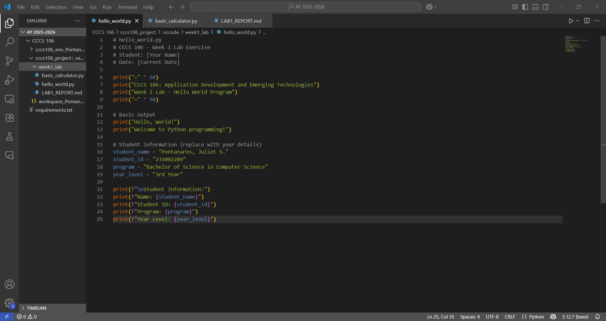
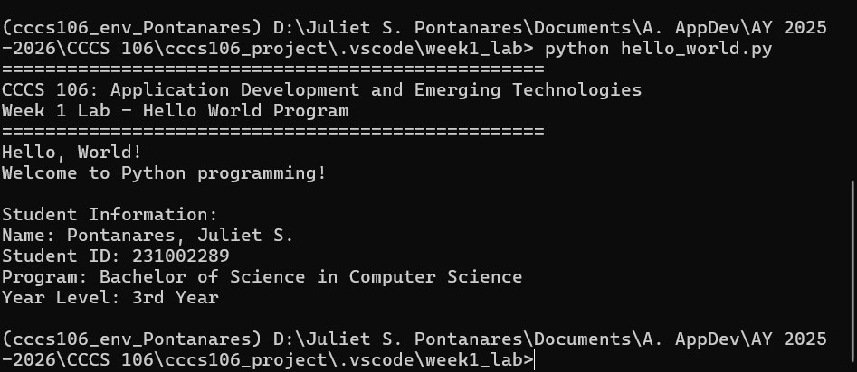
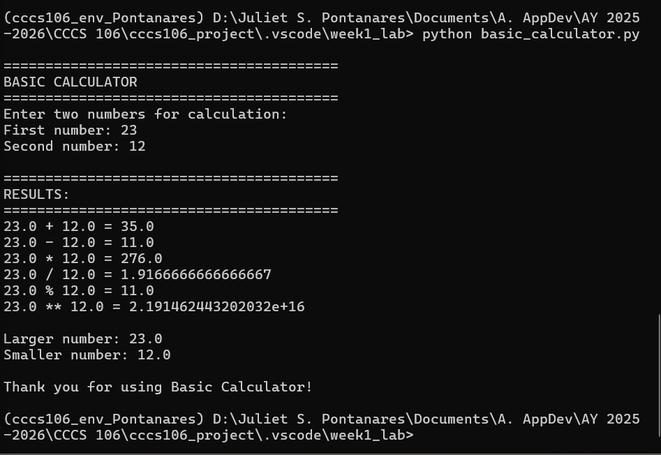

# Lab 1 Report: Environment Setup and Python Basics

**Student Name:** Pontanares, Juliet S.\
**Student ID:** 231002289\
**Section:** BSCS - 3A\
**Date:** 08/30/2025

## Environment Setup

### Python Installation
- **Python Version:** [e.g., 3.11.5]
- **Installation Issues:** I initially encountered confusion because Python was installed on Local Disk C, while my project files were saved on Local Disk D. This caused issues with locating files and managing environments. To resolve this, I reinstalled Python and set its location to Local Disk D, ensuring all related files and environments are now organized in the same drive.
- **Virtual Environment Created:** ✅ cccs106_env_Pontanares

### VS Code Configuration
- **VS Code Version:** [e.g., 1.82.0]
- **Python Extension:** ✅ Installed and configured
- **Interpreter:** ✅ Set to cccs106_env_Pontanares/Scripts/python.exe

### Package Installation
- **Flet Version:** 0.28.3
- **Other Packages:** 
	- `anyio==4.10.0`
	- `certifi==2025.8.3`
	- `exceptiongroup==1.3.0`
	- `h11==0.16.0`
	- `httpcore==1.0.9`
	- `httpx==0.28.1`
	- `idna==3.10`
	- `oauthlib==3.3.1`
	- `repath==0.9.0`
	- `six==1.17.0`
	- `sniffio==1.3.1`
	- `typing_extensions==4.15.0`

## Programs Created

### 1. hello_world.py
- **Status:** ✅ Completed
- **Features:** Student info display, age calculation, system info
- **Notes:** While trying to run the program in the VS Code terminal, I encountered an issue where the virtual environment could not be loaded due to some technicality. Thanks to Sir Ibo for teaching me to run it using the Command Prompt (cmd) instead, which resolved the problem.

### 2. basic_calculator.py
- **Status:** ✅ Completed
- **Features:** Basic arithmetic, error handling, min/max calculation
- **Notes:** Similar to the issue in `hello_world.py`, I was unable to run the code in the VS Code terminal because the virtual environment could not be loaded. Running the script using Command Prompt (cmd), as previously advised, resolved the problem.

## Challenges and Solutions
## Challenges and Solutions

Throughout Lab 1, I encountered several challenges:

1. **Python Installation Location:**  
	Initially, Python was installed on Local Disk C, while my project files were on Local Disk D. This caused confusion with file locations and environment management.  
	**Solution:** I reinstalled Python on Local Disk D to keep all related files and environments organized in the same drive.

2. **Virtual Environment Issues in VS Code Terminal:**  
	When trying to run my programs in the VS Code terminal, the virtual environment could not be loaded properly, preventing the scripts from executing.  
	**Solution:** Following my instructor’s advice, I switched to running the scripts using the Command Prompt (cmd), which allowed the virtual environment to load correctly and the programs to run without issues.

By addressing these problems, I was able to set up my environment successfully and complete the required programs.

## Learning Outcomes
Through this lab, I learned the importance of creating a virtual environment to keep my project dependencies isolated and organized. This ensures that my code and packages are managed in one place, reducing conflicts with other projects and making it easier to maintain. I also realized how crucial it is to properly configure the development environment, such as setting up Python and VS Code correctly, to avoid issues when running programs. Additionally, I gained hands-on experience with basic Python programming, including writing scripts, handling errors, and using external packages. Overall, these skills will help me work more efficiently and confidently on future programming projects.

### Screenshots

\
*Figure 1. Environment setup showing installation location, virtual environment, and package installations.*

\
*Figure 2. Visual Studio Code with Python extension installed and interpreter set to the virtual environment.*

### hello_world.py Output

\
*Figure 3. hello_world.py showing student information, calculated age, and system details.*

### basic_calculator.py Output
\
*Figure 4. basic_calculator.py running as a basic but interactive calculator, allowing user input for numbers and operations, displaying results, handling errors, and showing minimum and maximum values.*

	